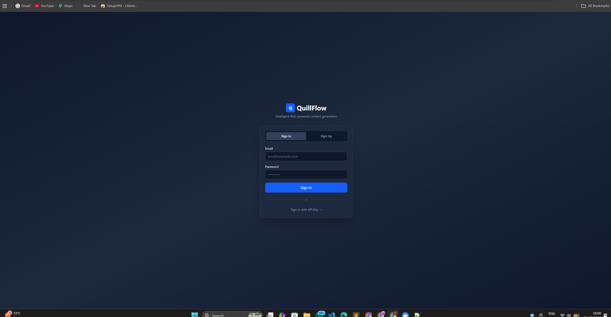
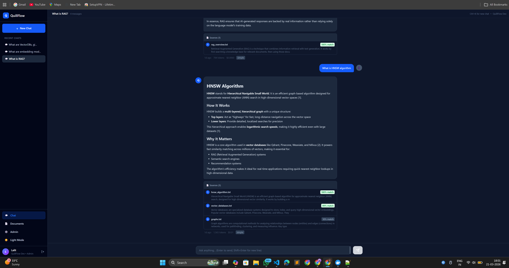
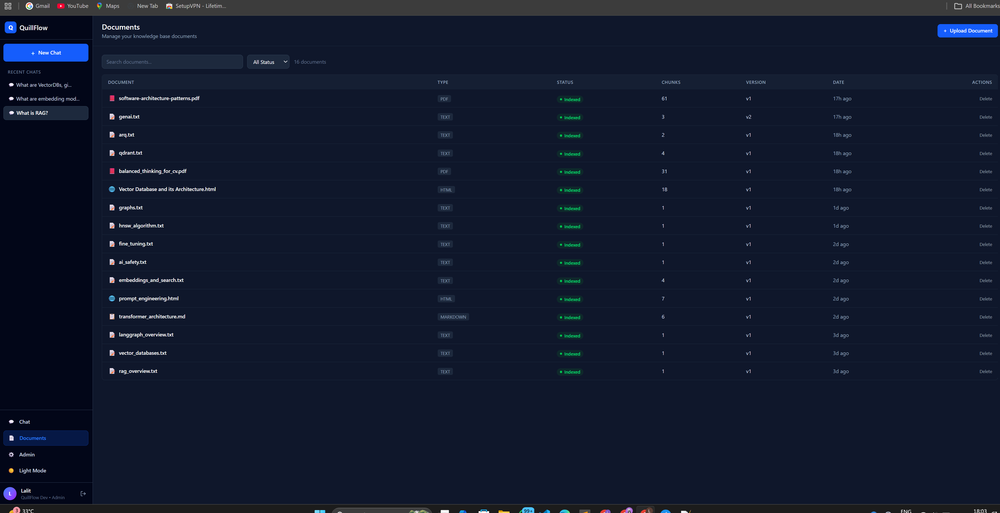
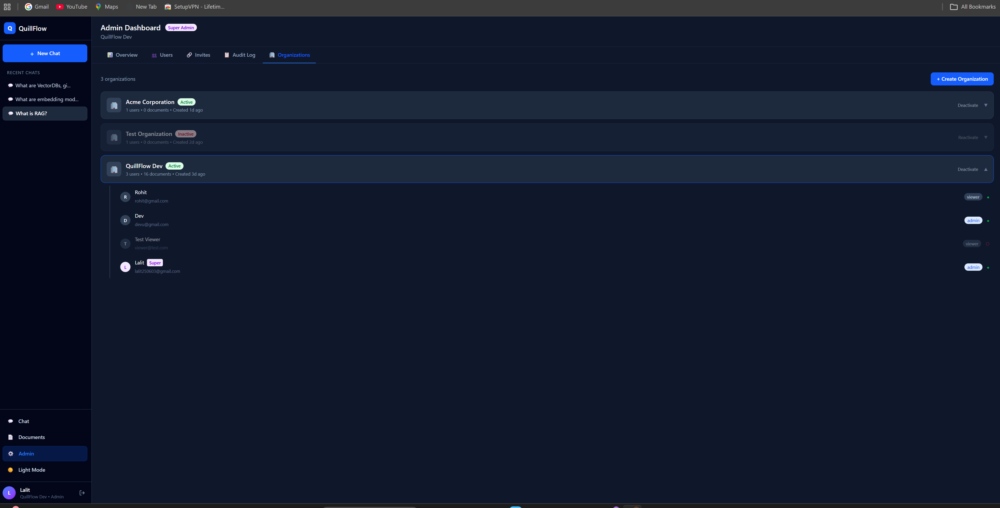
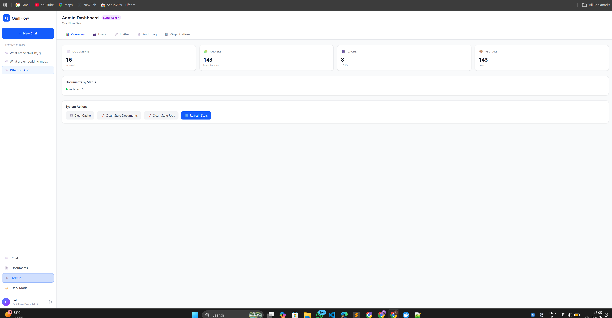

# 🚀 QuillFlow

<p align="center">
  <b>Production-grade Agentic RAG Content Generation System</b>
</p>

<p align="center">
  
  
  
  
  
</p>

<p align="center">
  <i>Agentic RAG system with hybrid retrieval, multi-step reasoning, and enterprise-grade architecture</i>
</p>

## ✨ Key Features

### Intelligent RAG Pipeline
- **Hybrid Retrieval** — Dense (Qdrant) + Sparse (BM25) + Cross-Encoder Reranking
- **Agentic Routing** — Automatically classifies queries as simple/complex
- **Multi-Section Generation** — Complex queries get planned, written in parallel, and merged
- **LLM Query Rewriting** — Follow-up questions are rewritten for better retrieval
- **Numbered Citations** — Every claim is traced back to source documents

### Document Management
- **Multi-Format Support** — PDF, HTML, Markdown, Plain Text
- **Multipart File Upload** — Direct file upload with drag & drop
- **Document Versioning** — Re-upload updates existing documents automatically
- **Background Processing** — Documents are parsed, chunked, embedded asynchronously

### Enterprise Security
- **Multi-Tenant** — Complete data isolation between organizations
- **Role-Based Access** — Viewer, Editor, Admin, Super Admin
- **JWT + API Key Auth** — Short-lived tokens with auto-refresh
- **Invite-Based Signup** — Admin-controlled user onboarding
- **Input Guardrails** — PII detection, prompt injection prevention, content policy

### Modern UI
- **Real-Time Streaming** — SSE-powered chat with progressive rendering
- **Multi-Turn Conversations** — Context-aware follow-up questions
- **Dark/Light Theme** — Persistent theme preference
- **Admin Dashboard** — Stats, user management, audit logs, org management

## 🏗️ Architecture

```text
Client → Frontend (React) → API (FastAPI) → LangGraph DAG
                                               ├── Input Filter (guardrails)
                                               ├── Cache Check (L1 exact + L2 semantic)
                                               ├── Router (classify query)
                                               ├── Retriever (hybrid search + rerank)
                                               ├── Planner (content plan for complex)
                                               ├── Writers (parallel sections)
                                               ├── Reducer (merge + cite)
                                               ├── Validator (quality check)
                                               └── Cache Write

Infrastructure:
  ├── Qdrant (vector store, HNSW index, gRPC)
  ├── PostgreSQL (users, docs, orgs, audit)
  ├── Redis (two-tier cache + job queue)
  └── ARQ Worker (background document processing)
```

## 🛠️ Tech Stack

| Layer | Technology |
|-------|-----------|
| Language | Python 3.12, TypeScript |
| Backend | FastAPI, Pydantic v2, SQLAlchemy 2.0 |
| Frontend | React 18, Vite, Tailwind CSS |
| Orchestration | LangGraph (stateful DAG) |
| LLM | Claude (Haiku 4.5 + Sonnet 4) via Databricks |
| Embeddings | BGE-large-en-v1.5 (self-hosted, 1024d) |
| Reranker | ms-marco-MiniLM-L-6-v2 (cross-encoder) |
| Vector DB | Qdrant (HNSW, gRPC) |
| Database | PostgreSQL 16 + Alembic migrations |
| Cache | Redis 7 (exact + semantic two-tier) |
| Task Queue | ARQ (async Redis-based) |
| Auth | JWT + bcrypt + API keys |
| Containers | Docker, Docker Compose |
| CI/CD | GitHub Actions, Helm, Kubernetes-ready |

## 🚀 Quick Start

### Prerequisites
- Docker Desktop
- Git

### One-Command Setup

```bash
# Clone
git clone https://github.com/lalitsharma250/quillflow.git
cd quillflow

# Configure
cp .env.example .env
# Edit .env — set your LLM API key and JWT secret

# Start everything
docker compose -f docker/docker-compose.yml --env-file .env up --build -d

# Wait for services (check status)
docker compose -f docker/docker-compose.yml ps

# Create first admin user
docker compose -f docker/docker-compose.yml exec api python scripts/docker_seed.py

# Open the app
# http://localhost:3000
```
### Default Credentials
Email:    admin@quillflow.local
Password: Admin@123
API Key:  (shown during seed script)

### One-Command setup
```bash
# Stop all services
docker compose -f docker/docker-compose.yml down

# Stop and delete all data (fresh start)
docker compose -f docker/docker-compose.yml down -v

# Restart
docker compose -f docker/docker-compose.yml --env-file .env up -d
```

## 💻 Local Development (Without Docker)

```bash
# Create virtual environment
python -m venv .venv
.venv\Scripts\activate        # Windows
# source .venv/bin/activate   # Mac/Linux

# Install dependencies
pip install -e ".[dev]"

# Start infrastructure only (Postgres, Redis, Qdrant)
docker compose -f docker/docker-compose.yml up -d postgres redis qdrant

# Run database migrations
alembic upgrade head

# Setup initial admin user
python -m scripts.setup_dev

# Start API server (terminal 1)
uvicorn app.main:create_app --factory --reload --host 0.0.0.0 --port 8000

# Start background worker (terminal 2)
arq app.workers.settings.WorkerSettings

# Start frontend (terminal 3)
cd frontend
npm install
npm run dev

# Open http://localhost:3000
```

---
## 📸 Screenshots

### 🔐 Authentication
<p align="center">
  
</p>

### 💬 Chat & Documents
<p align="center">
  
  
</p>

### 🛠️ Admin & Theme
<p align="center">
  
  
</p>

## 📊 API Endpoints (30+)

### 🔐 Authentication

| Method | Endpoint                 | Auth    | Description                     |
| ------ | ------------------------ | ------- | ------------------------------- |
| POST   | `/v1/auth/signup`        | Public  | Create account with invite code |
| POST   | `/v1/auth/login`         | Public  | Email + password login          |
| POST   | `/v1/auth/login/key`     | Public  | API key login                   |
| POST   | `/v1/auth/refresh`       | Public  | Refresh access token            |
| GET    | `/v1/auth/me`            | JWT/Key | Current user info               |
| GET    | `/v1/auth/invite/verify` | Public  | Verify invite code              |

### 💬 Chat

| Method | Endpoint   | Auth    | Description                               |
| ------ | ---------- | ------- | ----------------------------------------- |
| POST   | `/v1/chat` | JWT/Key | Query with streaming or complete response |

### 📄 Documents

| Method | Endpoint                 | Auth    | Description             |
| ------ | ------------------------ | ------- | ----------------------- |
| GET    | `/v1/documents`          | Viewer+ | List documents          |
| GET    | `/v1/documents/{id}`     | Viewer+ | Document details        |
| POST   | `/v1/ingest`             | Editor+ | Ingest text content     |
| POST   | `/v1/ingest/upload`      | Editor+ | Upload file (multipart) |
| POST   | `/v1/ingest/upload/bulk` | Editor+ | Upload multiple files   |
| POST   | `/v1/ingest/bulk`        | Editor+ | Bulk text ingestion     |
| GET    | `/v1/ingest/jobs/{id}`   | Viewer+ | Job progress            |

### 🛠️ Admin

| Method | Endpoint                          | Auth  | Description                    |
| ------ | --------------------------------- | ----- | ------------------------------ |
| GET    | `/v1/admin/stats`                 | Admin | System statistics (org-scoped) |
| POST   | `/v1/admin/users`                 | Admin | Create user                    |
| GET    | `/v1/admin/users`                 | Admin | List users                     |
| PATCH  | `/v1/admin/users/{id}/role`       | Admin | Change user role               |
| DELETE | `/v1/admin/users/{id}`            | Admin | Deactivate user                |
| PATCH  | `/v1/admin/users/{id}/reactivate` | Admin | Reactivate user                |
| POST   | `/v1/admin/users/{id}/api-key`    | Admin | Generate API key               |
| GET    | `/v1/admin/users/{id}/api-keys`   | Admin | List API keys                  |
| DELETE | `/v1/admin/api-keys/{id}`         | Admin | Revoke API key                 |
| POST   | `/v1/admin/invites`               | Admin | Generate invite code           |
| GET    | `/v1/admin/invites`               | Admin | List invite codes              |
| DELETE | `/v1/admin/invites/{code}`        | Admin | Revoke invite code             |
| GET    | `/v1/admin/audit`                 | Admin | View audit logs                |
| DELETE | `/v1/admin/cache`                 | Admin | Clear response cache           |
| DELETE | `/v1/admin/documents/stale`       | Admin | Clean stale documents          |
| DELETE | `/v1/admin/documents/{id}`        | Admin | Delete document + chunks       |
| DELETE | `/v1/admin/jobs/stale`            | Admin | Clean stale jobs               |

### 🧑‍💼 Super Admin

| Method | Endpoint                                    | Auth  | Description             |
| ------ | ------------------------------------------- | ----- | ----------------------- |
| GET    | `/v1/admin/superadmin/orgs`                 | Super | List all organizations  |
| POST   | `/v1/admin/superadmin/orgs`                 | Super | Create organization     |
| DELETE | `/v1/admin/superadmin/orgs/{id}`            | Super | Deactivate organization |
| PATCH  | `/v1/admin/superadmin/orgs/{id}/reactivate` | Super | Reactivate organization |
| GET    | `/v1/admin/superadmin/orgs/{id}/users`      | Super | List org users          |

### ⚙️ System

| Method | Endpoint     | Auth | Description       |
| ------ | ------------ | ---- | ----------------- |
| GET    | `/health`    | None | Liveness probe    |
| GET    | `/v1/health` | None | Deep health check |

---

## 🔒 Security Model

```text
Layer 1 — Authentication:
  ├── JWT Tokens (1h access + 7d refresh, auto-refresh)
  ├── API Keys (SHA-256 hashed, for programmatic access)
  └── bcrypt password hashing

Layer 2 — Authorization (RBAC):
  ├── Viewer:     Chat only
  ├── Editor:     Chat + Ingest documents
  ├── Admin:      Full org management
  └── Super Admin: Cross-org management

Layer 3 — Data Isolation:
  ├── PostgreSQL: WHERE org_id = auth.org_id (every query)
  ├── Qdrant:     filter: org_id = auth.org_id (every search)
  └── Redis:      Key prefix includes org_id

Layer 4 — Input Safety:
  ├── PII Detection (email, phone, SSN → replaced with tokens)
  ├── Prompt Injection Detection
  └── Content Policy Enforcement
```

---

## 🔄 RAG Pipeline Flow

```text
User Query: "What is RAG?"
     │
     ▼
[Input Filter] → PII scan, injection check, content policy
     │
     ▼
[Cache Check] → L1 exact hash match → L2 semantic similarity (>0.95)
     │ (miss)
     ▼
[Router] → Haiku classifies: simple or complex
     │
     ▼
[Retriever] → Query rewrite (if follow-up) → Hybrid search → Rerank
     │
     ├── Simple path ──────────────────────────────────┐
     │                                                 │
     ├── Complex path:                                 │
     │   [Planner] → 2-3 sections with word budgets    │
     │   [Writers] → Parallel LLM calls per section    │
     │   [Reducer] → Merge + polish                    │
     │                                                 │
     ▼                                                 ▼
[Reducer] → Generate answer with [1], [2] citations
     │
     ▼
[Validator] → Faithfulness + relevancy scoring (complex only)
     │
     ▼
[Cache Write] → Store for future identical/similar queries
     │
     ▼
Response with sources, usage stats, eval scores
```

---

## 📁 Project Structure

```text
QuillFlow/
├── app/
│   ├── api/
│   │   ├── middleware/      # Auth, RBAC, rate limiting
│   │   └── v1/             # API endpoints
│   ├── graph/
│   │   ├── nodes/
│   │   ├── edges.py
│   │   ├── state.py
│   │   └── builder.py
│   ├── services/
│   │   ├── llm/
│   │   ├── retrieval/
│   │   ├── ingestion/
│   │   └── cache/
│   ├── db/
│   │   ├── models.py
│   │   └── repository.py
│   ├── models/
│   │   ├── domain.py
│   │   ├── requests.py
│   │   └── responses.py
│   ├── workers/
│   │   ├── tasks.py
│   │   └── settings.py
│   └── main.py
├── frontend/
│   ├── src/
│   │   ├── api/
│   │   ├── components/
│   │   ├── pages/
│   │   ├── stores/
│   │   └── lib/
│   └── Dockerfile
├── docker/
│   ├── docker-compose.yml
│   ├── Dockerfile
│   └── Dockerfile.worker
├── alembic/
├── config/
├── scripts/
├── .env.example
├── pyproject.toml
└── README.md
```

---

## ⚙️ Configuration

Copy `.env.example` to `.env` and configure:

```bash
# LLM Provider (required)
QUILL_LLM_PROVIDER_BASE_URL=https://your-provider.com/serving-endpoints
QUILL_LLM_API_KEY=your-api-key
QUILL_LLM_MODEL_FAST=your-fast-model
QUILL_LLM_MODEL_STRONG=your-strong-model

# JWT Secret
QUILL_JWT_SECRET_KEY=your-secret-key

# Database
QUILL_POSTGRES_HOST=localhost
QUILL_POSTGRES_PASSWORD=quillflow_dev

# Optional tuning
QUILL_CHUNK_SIZE=512
QUILL_CHUNK_OVERLAP=64
QUILL_RETRIEVAL_TOP_K=10
QUILL_RERANKER_TOP_K=5
QUILL_CACHE_TTL_SECONDS=86400
QUILL_SEMANTIC_CACHE_THRESHOLD=0.95
```

---

## 🧪 Running Tests

```bash
# Unit tests
pytest tests/unit/ -v --cov=app

# Integration tests (requires infrastructure)
pytest tests/integration/ -v

# All tests
pytest -v --cov=app --cov-report=term-missing
```

---

## 📄 License

MIT License — see LICENSE for details.

```
Copyright (c) 2026 lalitsharma250

Permission is hereby granted, free of charge, to any person obtaining a copy
of this software and associated documentation files (the "Software"), to deal
in the Software without restriction, including without limitation the rights
to use, copy, modify, merge, publish, distribute, sublicense, and/or sell
copies of the Software, and to permit persons to whom the Software is
furnished to do so, subject to the following conditions:

The above copyright notice and this permission notice shall be included in all
copies or substantial portions of the Software.

THE SOFTWARE IS PROVIDED "AS IS", WITHOUT WARRANTY OF ANY KIND, EXPRESS OR
IMPLIED, INCLUDING BUT NOT LIMITED TO THE WARRANTIES OF MERCHANTABILITY,
FITNESS FOR A PARTICULAR PURPOSE AND NONINFRINGEMENT. IN NO EVENT SHALL THE
AUTHORS OR COPYRIGHT HOLDERS BE LIABLE FOR ANY CLAIM, DAMAGES OR OTHER
LIABILITY, WHETHER IN AN ACTION OF CONTRACT, TORT OR OTHERWISE, ARISING FROM,
OUT OF OR IN CONNECTION WITH THE SOFTWARE OR THE USE OR OTHER DEALINGS IN THE
SOFTWARE.
```
